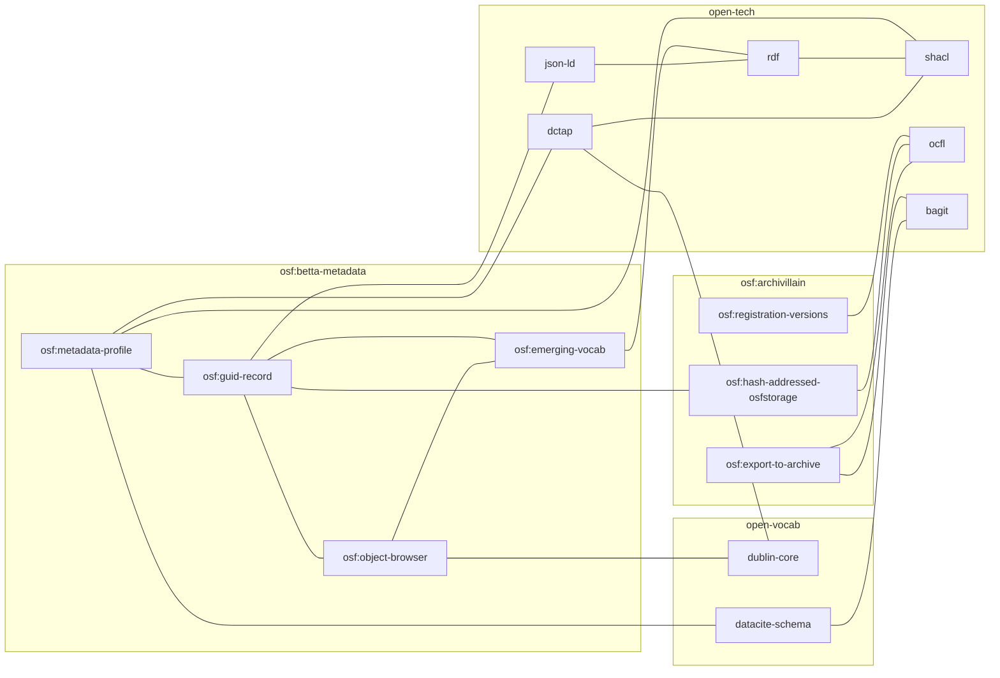

```mermaid
graph LR;
    subgraph open-vocab
        dublin-core
        datacite-schema
    end
    subgraph open-tech
        dctap --- shacl
        json-ld --- rdf --- shacl
        ocfl
        bagit
    end
    dctap --- dublin-core
    datacite-schema --- bagit

    subgraph osf:betta-metadata
        osf:metadata-profile --- osf:guid-record --- osf:object-browser
        osf:object-browser --- osf:emerging-vocab --- osf:guid-record
    end
    subgraph osf:archivillain
        osf:hash-addressed-osfstorage
        osf:export-to-archive
        osf:registration-versions
    end
    osf:emerging-vocab --- rdf
    osf:export-to-archive --- bagit
    osf:export-to-archive --- ocfl
    osf:guid-record --- json-ld
    osf:guid-record --- osf:hash-addressed-osfstorage
    osf:hash-addressed-osfstorage --- ocfl
    osf:metadata-profile --- datacite-schema
    osf:metadata-profile --- dctap
    osf:metadata-profile --- shacl
    osf:object-browser --- dublin-core
    osf:registration-versions --- ocfl
```
